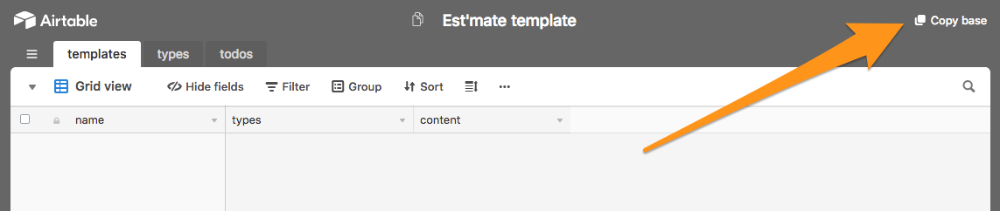
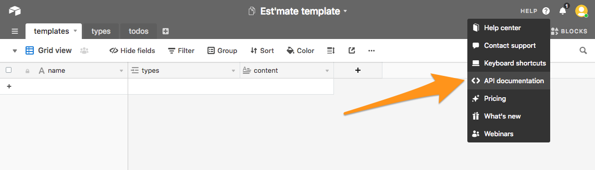
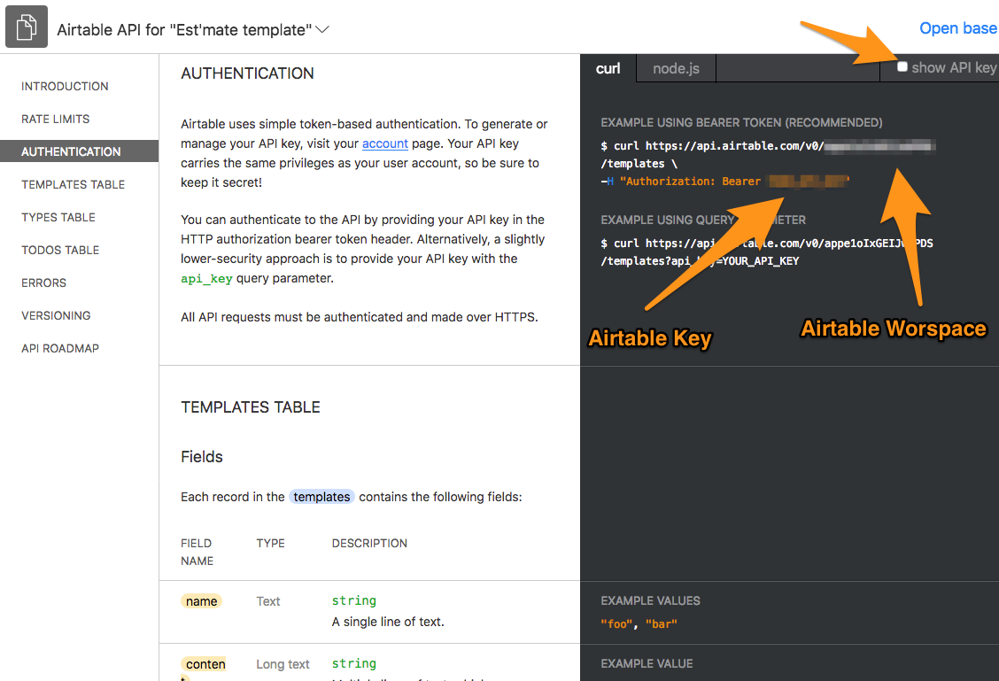

# Airtable template feature

With Esti'mate, you can create your own custom templates based on the types of each row using Airtable.

## Setup Airtable

First, you need an Airtable account (obviously).

Then you have 2 options :
- Create a new base from scratch
- Use the official template (recommended)

#### From scratch

You must create a new Airtable a **new base** with, at least, the following structure :

```plain
- templates
	- name (Single line text)
	- types (Link to types, multiple records)
	- content (Long text)
- types
	- name (Single line text)
- todos
	- Content (Single line text)
```

#### With the template

Simply go to the [template URL](https://airtable.com/shrr7CAKKbbOOCtAF) and click on “**Copy base**”



Then, on your fresh new base, click on “**Help>API documentation**”



Here, you can access to the full API documentation of your new base and, important here, get you **API key** and **Workspace/base ID** for the Esti'mate settings panel.



## Setup Esti'mate

#### Firefox

1. Type `about:addons` in your address bar
2. Click on the Esti'mate's “**Settings**” button
3. Enter you Worskpace and Key (see previous step)

#### Chrome

1. Find the Esti'mate icon in your toolbar
2. Click on “**Settings**”
3. Enter you Worskpace and Key (see previous step)


